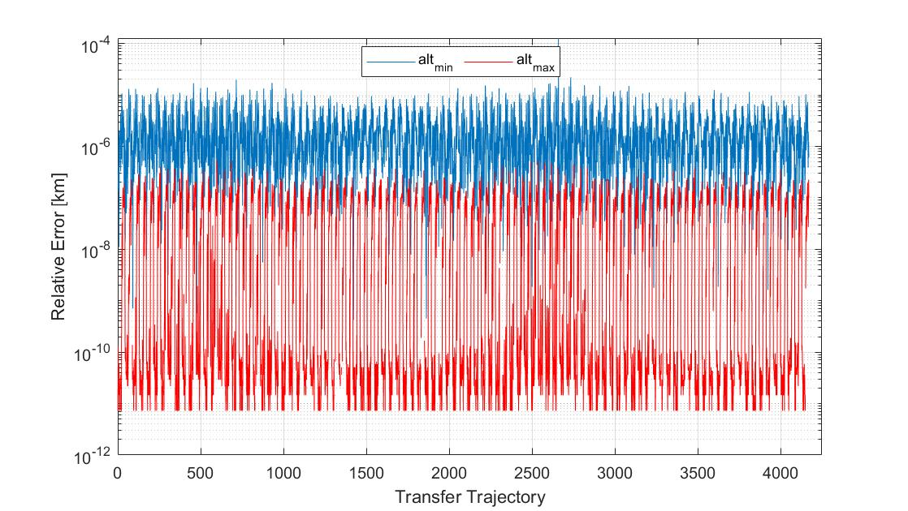

# KeplerMinMax
A novel closed-form solution to compute the surface altitude extrema for any two-body orbit is extended to oblate spheroids using Halley's method (a root finding technique with cubic convergence). Runtime performance has improved between three and five orders of magnitude while maintaining solution accuracy within several centimeters of numerically computed extrema when comparing this routine to conventional numerical minimization techniques such as fminbnd.  This method is simple to port to flight hardware it requires little computational overhead, few lines of code, and a small memory footprint.

This repository contains a C code implementation of keplerMinMax as outlined in the 2021 AMOS conference paper Novel Closed Form Solution for Orbit Segment Altitude Extrema Over Spherical and Oblate Central Bodies, it also has a MATLAB-C wrapper which allows for calling in a MATLAB environment. To compile a C MEX file in your MATLAB environment, execute the following command in your MATLAB command window:

    >> mex keplerMinMaxMex.c keplerMinMax.c
    
The MATLAB MEX adapter, keplerMinMaxAdapter.m, is the MATLAB interface routine for keplerMinMax where it can be invoked by

    [minAlt,maxAlt] = keplerMinMaxAdapter(r0,v0,rf,vf,tf,params,dim3);
    
r0 is an N-Dimensional position state vector, and its dimensions must be identical to those of v0, rf, and vf.  The singleton dimension specifier, dim3, indicates which dimension corresponds to [x,y,z], tf must have identical dimensions to r0, v0, rf, vf except for it's singleton dimension which should be unity instead of three.
    
    
Once the C code is compiled into a MEX file, run the demo script to verify the configuration

    >> keplerMinMaxDemo();
    
    
The runtime performance of keplerMinMax as well as fminbnd should be printed to the MATLAB Comand Window similar to

    >> keplerMinMaxDemo:: keplerMinMax Execution Time = 0.038463 [s]
    >> keplerMinMaxDemo:: fminbnd Execution Time =  66.5425 [s]

Next, a relative position error plot is displayed with the absolute difference in altitude minima and maxima values between implementations as shown below

The C routine is direclty accessible and included in keplerMinMax.c for inline function calls via

        keplerMinMax(r0, v0, rf, vf, tf, mu, Re, Rp, Npts, minAlt, maxAlt);

A preliminary check on the equatorial and polar radius of the spheroid is performed internally; if Re = Rp, then keplerMinMaxSphere is invoked within to save computational overhead.  A direct inline function call to the spherical altitude routine, keplerMinMaxSphere, can be performed as follows

       keplerMinMaxSphere(r0, v0, rf, vf, tf, mu, R, minAlt, maxAlt);

where R is the spherical radius of the central body, mu is the standard gravitaional parameter, and the other inputs/outputs are in the same format and size as specified by keplerMinMax.

References:

Koblick, Darin C. "Novel Closed Form Solution for Orbit Segment Altitude Extrema Over Spherical and Oblate Central Bodies." AMOS 2021 (2021): 10.
